# End-to-End DevSecOps CI/CD Pipeline & Supply Chain Security

[](https://github.com)
[-2496ED?logo=docker&logoColor=white)](https://www.docker.com/)
[](https://aquasecurity.github.io/trivy/)
[](https://github.com/anchore/syft)
[](https://fastapi.tiangolo.com/)

## 📌 Executive Summary

This repository showcases an elite **DevSecOps Software Supply Chain Security Pipeline** and containerized cloud microservice. Built around the principles of **Shift-Left Security**, zero-trust containerization, and automated compliance, this project implements continuous security validation from code commit to container registry artifact generation.

---

## 🔐 DevSecOps Supply Chain Architecture

Modern SRE and DevOps practices dictate that security must be automated and embedded into the Continuous Integration lifecycle.

```mermaid
sequenceDiagram
    autonumber
    actor Developer as 👩‍💻 Developer
    participant GitHub as 📚 GitHub Repository
    participant Actions as ⚡ GitHub Actions CI/CD
    participant Trivy as 🛡️ Trivy Scanner (CVEs)
    participant SBOM as 📦 Syft / Grype (SBOM)
    participant GHCR as 🐳 GitHub Container Registry

    Developer->>GitHub: Push Code / Pull Request
    GitHub->>Actions: Trigger DevSecOps Workflow
    
    rect rgb(20, 30, 50)
        Note over Actions,Trivy: Step 1: Static Code Analysis & Linting
        Actions->>Actions: Run Flake8 & Black Formatting Check
        Actions->>Actions: Execute Pytest Unit Tests with Coverage
    end

    rect rgb(30, 20, 50)
        Note over Actions,SBOM: Step 2: Multi-Stage Container Build & Scan
        Actions->>Actions: Build Non-Root Distroless Docker Image
        Actions->>Trivy: Scan Container Layers for OS/Library CVEs
        Trivy-->>Actions: Vulnerability Report (Block on CRITICAL/HIGH)
    end

    rect rgb(20, 50, 30)
        Note over Actions,GHCR: Step 3: Provenance & Artifact Attestation
        Actions->>SBOM: Generate Software Bill of Materials (SPDX JSON)
        Actions->>GHCR: Push Multi-Arch Image (amd64 / arm64) + SBOM
    end
```



---

## ✨ Key Security & DevOps Best Practices

| Security Domain | Implementation in this Pipeline | Enterprise Impact |
| :--- | :--- | :--- |
| **🛡️ Container Hardening** | Multi-stage Docker build utilizing a **non-root user (UID 10001)** and minimal base images (`python:3.11-slim`). | Eliminates root escalation attack vectors and shrinks container image footprint by over **60%**. |
| **🔍 CVE Vulnerability Scanning** | **Trivy** integrates directly into the pull request check, blocking merges if critical or high-severity vulnerabilities exist. | Preemptively stops zero-day and known CVE vulnerabilities from reaching Kubernetes. |
| **📦 SBOM Generation** | **Anchore Syft** automatically generates a Software Bill of Materials in SPDX format attached to image releases. | Meets Executive Order 14028 software supply chain compliance requirements. |
| **⚡ Multi-Architecture Builds** | Docker Buildx builds identical binary images for both `linux/amd64` (Intel/AMD) and `linux/arm64` (AWS Graviton3). | Enables seamless deployment to cost-efficient AWS Graviton Spot instances. |

---

## 📂 Repository Structure

```text
├── src/
│   ├── main.py              # Cloud-native FastAPI microservice with JSON telemetry
│   └── requirements.txt     # Locked application dependencies
├── Dockerfile               # Multi-stage, non-root container specification
└── .github/
    └── workflows/
        └── devsecops-pipeline.yml # Automated linting, Trivy scan, SBOM, and GHCR publish
```

---

## 🛠️ Local Development & Testing Guide

### 1. Run Microservice Locally
```bash
python -m venv venv
source venv/bin/activate  # On Windows: .\venv\Scripts\activate
pip install -r src/requirements.txt
uvicorn src.main:app --host 0.0.0.0 --port 8080 --reload
```

### 2. Build & Test Hardened Container Locally
```bash
# Build docker image
docker build -t devsecops-service:latest .

# Verify container runs as non-root user
docker run --rm devsecops-service:latest whoami
# Output: appuser (UID 10001)

# Run local vulnerability scan with Trivy
trivy image --severity HIGH,CRITICAL devsecops-service:latest
```

---
*Created as part of an Advanced DevOps & Cloud Engineering Portfolio showcase.*
